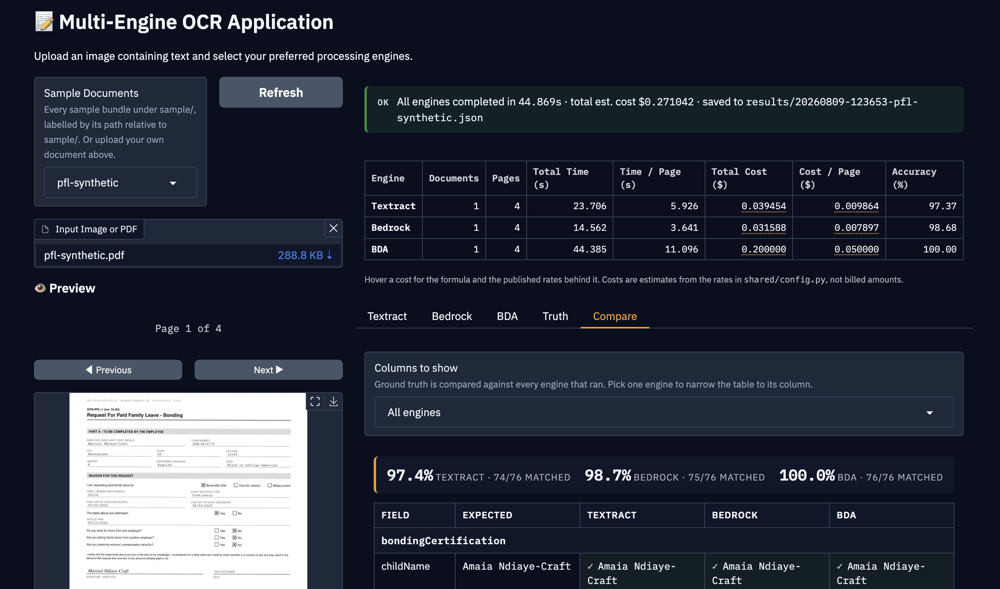
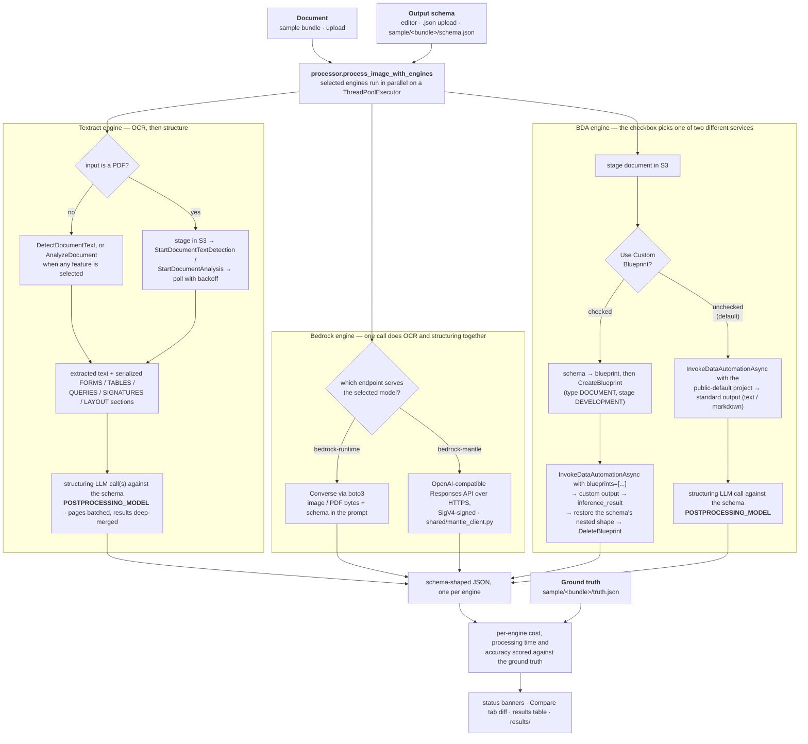

# OCR with AWS AI Services

A comprehensive application for comparing OCR (Optical Character Recognition) capabilities across multiple AWS AI services: Amazon Textract, Amazon Bedrock, and Amazon Bedrock Data Automation (BDA).

## Overview

This application provides a unified interface for extracting text and structured data from
single-page images and multi-page PDFs using three different AWS AI services:

1. **Amazon Textract**: AWS's dedicated OCR service for extracting text, forms, and tables from documents
   - After calling the Amazon Textract API to extract text, the application uses LLM to structure the extracted data into JSON format according to the provided schema.
   - The analysis features are selectable per run (FORMS, TABLES, QUERIES, SIGNATURES, LAYOUT) — see [Textract Configuration](#textract-configuration).
2. **Amazon Bedrock**: Using foundation models for document understanding and extraction
   - Uses foundation models directly for both extraction and JSON structuring in a single step.
   - The model is selectable per run, across both the `bedrock-runtime` and
     `bedrock-mantle` endpoints — see [Bedrock models](#bedrock-models).
3. **Amazon Bedrock Data Automation (BDA)**: AWS's specialized image/document analysis service
   - **Custom Blueprint Method**: Creates a custom document processing blueprint based on the provided JSON schema
   - **LLM Post-processing Method**: Uses standard BDA extraction followed by Bedrock LLM to structure the data (default method)



The application enables side-by-side comparison of these services' accuracy, cost, and processing time across different document types, helping you choose the optimal service for your specific OCR needs.

## Key Features

- **Multi-Engine OCR Processing**: Process the same document with Textract, Bedrock, and BDA simultaneously
- **Multi-Page PDF Support**: Score whole PDFs end to end — Textract runs through its
  asynchronous APIs, page text is batched into as few structuring calls as fit the budget,
  and every engine returns one schema-shaped result (see
  [Structured output for multi-page PDFs](#structured-output-for-multi-page-pdfs))
- **Interactive UI**: User-friendly interface for testing and comparing OCR engines
- **Performance Comparison**: Side-by-side comparison of extraction quality, processing time, and cost
- **Accuracy Evaluation**: Compare extracted data against ground truth for objective evaluation
- **Cross-Engine Comparison View**: One table putting ground truth beside every engine that
  ran, field by field, filterable to a single engine (see
  [Reading the Compare tab](#reading-the-compare-tab))
- **JSON Schema Support**: Structure extracted data according to custom schemas, typed into the editor or uploaded from a `.json` file
- **Configurable Textract Features**: Select any combination of FORMS, TABLES, QUERIES, SIGNATURES and LAYOUT per run
- **Cost Calculation**: Real-time cost estimation for each service, including Textract's per-feature and bundle pricing
- **Batch Processing**: Process multiple sample documents at once
- **Result Visualization**: Visual annotation of detected text elements, drawn over the
  document's own rendered pages for PDFs
- **Recorded Runs**: Every run written to `results/` — per-engine accuracy, time, pages and
  cost, each cost figure carrying the arithmetic behind it (see [Results](#results))
- **Legible in Light and Dark**: One stylesheet that never assumes which Gradio palette
  is active, with WCAG AA contrast asserted numerically rather than by screenshot (see
  [Themes and readability](#themes-and-readability))

## Architecture

The application follows a modular architecture with several key components:

- **Engine Implementations**: Separate modules for each AWS service (Textract, Bedrock, BDA)
- **User Interface**: Gradio-based UI for interactive testing and result visualization
- **Core Processing**: Parallel execution of OCR engines with standardized result handling
- **Sample Management**: Utilities for working with test documents and sample data
  (`shared/sample_paths.py`)
- **Evaluation Tools**: Components for accuracy assessment and comparison
- **Session Resolution**: The one explicitly resolved profile and region every engine
  authenticates with, and the identity logged at startup (`shared/aws_client.py`)
- **Cross-Engine Comparison**: The field-by-field table putting ground truth beside every
  engine that ran (`shared/comparison_utils.py`)
- **Page Merging**: Deep-merge of the per-batch structuring results into one
  schema-shaped object (`shared/json_merge.py`)
- **Cost Model**: The published per-page, per-feature and per-token rates, and the
  formula recorded alongside every figure (`shared/cost_calculator.py`)
- **Results Table**: The headline per-engine figures and their hover-over arithmetic
  (`shared/results_table.py`)
- **Blueprint Translation**: JSON Schema to BDA blueprint and back again
  (`shared/blueprint_schema.py`)
- **Mantle Client**: SigV4-signed HTTPS access to the models boto3 cannot reach
  (`shared/mantle_client.py`)
- **PDF Rendering**: Page rasterisation and per-engine bounding-box overlays
  (`shared/pdf_render.py`)
- **Run Recording**: Per-run records and a flat history line per engine under `results/`
  (`shared/run_recorder.py`)
- **Visual Language**: One theme and one stylesheet, legible in both Gradio palettes
  (`shared/ui_theme.py`)

### Pipeline flow

One document, one schema, three engines running concurrently, and one comparison at
the end. The important thing the diagram makes visible is that the three engines
produce their schema-shaped JSON in three different ways: Textract and BDA extract
text and then hand it to a second model to structure, while Bedrock does both in a
single call.



`POSTPROCESSING_MODEL` in `shared/config.py` is the model used by every structuring
step — the one Textract feeds and the one BDA feeds when the blueprint is off. It is
deliberately the same model as the Bedrock engine's default, so post-processing
quality is not a hidden variable when the three engines' accuracy figures are
compared.

## Requirements

- Python 3.10+
- AWS Account with access to:
  - Amazon Textract
  - Amazon Bedrock (with access to supported models)
  - Amazon Bedrock Data Automation
- AWS credentials configured locally
- An S3 bucket in the same account and region as those credentials. This is not
  optional: Textract's PDF path is asynchronous and can only read from S3. See
  [Selecting the S3 bucket](#selecting-the-s3-bucket).

## Installation

1. Clone the repository:

   ```
   git clone https://github.com/aws-samples/ocr-with-aws-ai-services.git
   cd ocr-with-aws-ai-services
   ```

2. Install required packages:

   ```
   pip install -r requirements.txt
   ```

3. Configure AWS credentials using one of the following methods:
   - AWS CLI: `aws configure`
   - Environment variables
   - Credentials file (~/.aws/credentials)

## Usage

### Selecting the AWS profile

The app authenticates with one explicitly resolved profile. Set `OCR_AWS_PROFILE` to
choose it:

```
export OCR_AWS_PROFILE=your-profile
export OCR_AWS_REGION=us-east-1     # optional
python app.py
```

`OCR_AWS_PROFILE` takes precedence over `AWS_PROFILE`. It exists so this app can be
pinned to one account without exporting `AWS_PROFILE` process-wide, which would also
redirect other AWS tooling sharing the same shell. Region resolution follows the same
order: `OCR_AWS_REGION`, then `AWS_REGION`, then `AWS_DEFAULT_REGION`, then whatever
the profile declares.

With a profile set, startup logs the identity it will actually use:

```
INFO  AWS profile: your-profile (from OCR_AWS_PROFILE) | region: us-east-1
INFO  AWS identity: account <account-id>, arn:aws:sts::<account-id>:assumed-role/...
```

With no profile set, boto3's default credential chain applies and startup warns,
naming the account it resolved to:

```
WARNING  No OCR_AWS_PROFILE or AWS_PROFILE set - using boto3's default credential
         chain, which resolved to account <account-id> (...). Set OCR_AWS_PROFILE to
         pin this app to a specific account.
```

**Check that account is the one you expect.** Authenticating a profile the app does
not consult looks exactly like not authenticating at all: every engine fails with a
credential or `AccessDenied` error that says nothing about profiles. If the profile
name does not exist in your AWS config, startup logs an error listing the profiles
that do.

Expired credentials are reported per engine, naming the profile that needs
re-authentication. The app never refreshes credentials itself — a UI click must not
trigger an interactive auth flow on the server.

### Selecting the S3 bucket

Documents are staged in S3 before processing, so the bucket must exist in the same
account and region as your credentials. Set it with `OCR_S3_BUCKET`:

```
export OCR_S3_BUCKET=your-bucket
export OCR_BDA_S3_BUCKET=your-bda-bucket   # optional, defaults to OCR_S3_BUCKET
```

Both values are also editable at run time in the **🪣 S3 buckets** section of the UI,
which overrides the environment for that session.

**Set it on a fresh clone.** With `OCR_S3_BUCKET` unset, `shared/config.py` falls back
to the bucket this app was developed against, which is not in your account — so every
staging upload fails with the `403` described next, and nothing in the message mentions
a bucket name you did not choose.

A bucket in someone else's account fails in a way that is easy to misread: S3 returns
`403 Forbidden` for a bucket you do not own, not `404`, so an upload failure looks
like a permissions problem with your own credentials. To check a bucket is really
yours:

```
aws s3api head-bucket --bucket your-bucket --profile your-profile
```

`403` means the name is taken by another account — pick a different one. Note that
Textract must be called in the bucket's region, so keep `OCR_AWS_REGION` and the
bucket in the same region.

### Tuning Textract asynchronous polling

PDFs go through Textract's asynchronous APIs, which queue the job service-side and
return a job ID. Queue latency is not a function of page count or file size: the same
7-page scanned PDF has been measured at 36 seconds on one attempt and over 300 seconds
on another. The app therefore waits 15 minutes by default before giving up:

```
export OCR_TEXTRACT_ASYNC_TIMEOUT_SECONDS=900   # default
```

Polling backs off from 2 to 15 seconds so a short job is still noticed within a second
or two while a long one does not make hundreds of API calls. The interval is tunable if
needed:

```
export OCR_TEXTRACT_ASYNC_POLL_INITIAL_SECONDS=2
export OCR_TEXTRACT_ASYNC_POLL_MAX_SECONDS=15
export OCR_TEXTRACT_ASYNC_POLL_BACKOFF=1.5
```

If the timeout is reached, the job itself is usually still running rather than broken.
Textract keeps results for 7 days, so the error names the job ID and how to collect
the work you have already paid for:

```
aws textract get-document-text-detection --job-id <job-id>
```

Use `get-document-analysis` instead when any Textract feature was selected.

### Bedrock models

The Bedrock engine offers four models, all vision-capable because every request here
carries an image or a PDF:

| Model              | Model ID                       | Endpoint          | Input / output per 1M tokens |
| ------------------ | ------------------------------ | ----------------- | ---------------------------- |
| Claude Sonnet 5    | `us.anthropic.claude-sonnet-5` | `bedrock-runtime` | $2 / $10 (see note)          |
| Amazon Nova 2 Lite | `us.amazon.nova-2-lite-v1:0`   | `bedrock-runtime` | $0.30 / $2.50                |
| GPT-5.6 Terra      | `openai.gpt-5.6-terra`         | `bedrock-mantle`  | $2.20 / $13.20               |
| GPT-5.6 Luna       | `openai.gpt-5.6-luna`          | `bedrock-mantle`  | $0.22 / $1.32                |

Claude Sonnet 5's rate is promotional launch pricing that runs through 2026-08-31,
after which it becomes $3 / $15. The GPT-5.6 rates are the short-context
(≤272K tokens) tier, which is the tier every request in this app falls into; the
1M-context tier is exactly double.

Text-only models are deliberately excluded, including the gpt-oss family — they cannot
read a document at all, so they have nothing to contribute to an OCR comparison.

#### The two endpoints

The models are not all reached the same way, and the difference is not cosmetic:

- **`bedrock-runtime`** — the Converse API through boto3. The `us.` prefix marks a
  cross-region inference profile, so requests are served from whichever US region has
  capacity.
- **`bedrock-mantle`** — an OpenAI-compatible Responses API on a separate host, at
  `https://bedrock-mantle.<region>.api.aws/openai/v1/responses`. These models are
  **not usable through boto3**: botocore ships no `bedrock-mantle` service model, so no
  client can be built for it, and `converse()` rejects their model IDs. `shared/mantle_client.py`
  calls them over plain HTTPS, signed with SigV4 under the `bedrock` service name using
  the same profile credentials as every other AWS call — AWS's own examples use a
  separate Bedrock API key with the `openai` SDK, which this app does not require.

Two consequences worth knowing:

- These models take **no `us.` prefix**. Neither geo nor global inference profiles
  exist for them, so the bare model ID is correct.
- They do not appear in `aws bedrock list-foundation-models`, which reports
  `bedrock-runtime` models only. Absence there looks exactly like the model not
  existing.

Cost reporting covers both endpoints. Note that the GPT-5.6 models emit reasoning
tokens, which are billed as output tokens and count against
`OCR_LLM_MAX_OUTPUT_TOKENS`, so they can exhaust that budget before producing any
text. That is reported as truncation, the same as for the Converse models.

### Structured output for multi-page PDFs

Textract returns text page by page, but the output schema and the ground truth files
are organised by form section, and a section can span a page boundary. So page text is
batched into as few post-processing LLM calls as fit a character budget and the results
are deep-merged into one schema-shaped object:

```
export OCR_LLM_STRUCTURING_CHAR_BUDGET=120000   # default, ~30,000 tokens
```

A typical claim form fits in a single call, which lets the model see every page at once.
When a document does need more than one call, fields found in different calls are
united, a later null never overwrites an earlier extracted value, and list items are
appended with duplicates dropped. If two calls disagree on a scalar the first value is
kept and a warning naming the field path and both values is logged.

Model output limits are set explicitly, because Bedrock otherwise caps output at 4096
tokens and truncates mid-string — which shows up only as a JSON parse error:

```
export OCR_LLM_MAX_OUTPUT_TOKENS=16384   # default
```

One setting covers both the post-processing structuring step and the Bedrock engine's
own extraction call. The Bedrock engine is the more demanding of the two, since a
single call there covers OCR and structuring for a whole document.

If a response is still truncated, the app reports it as truncation rather than
returning incomplete text as a successful result — otherwise the missing fields would
be scored as poor extraction accuracy. Either raise `OCR_LLM_MAX_OUTPUT_TOKENS`, or
lower `OCR_LLM_STRUCTURING_CHAR_BUDGET` so fewer pages are structured per call.

### Starting the Application

Run the application with:

```
python app.py
```

This will start the Gradio web interface, typically accessible at http://localhost:7860 (or the URL displayed in your terminal).

### Using the Interface

1. **Select or Upload a Document**:
   - Choose from the **Sample Documents** dropdown, which lists every sample preloaded
     under `sample/` — one entry per bundle, labelled by its path relative to `sample/`
     (`sheet`, `pfl-synthetic`, `claims/STD/case-77315`) — or
   - Upload your own image or PDF using the upload control

   Selecting a sample loads its preview — with page navigation for multi-page PDFs —
   and, when they exist, the `schema.json` and `truth.json` sitting beside the document
   in its own directory. See [Sample Data](#sample-data) for the layout and for how to
   add your own.

2. **Select OCR Engines**:
   - Choose one or more OCR engines to use (Textract, Bedrock, BDA)
   - Configure engine-specific options as needed

3. **Set Processing Options**:
   - Document type (generic, form, receipt, table, handwritten)
   - Textract analysis features and queries (see [Textract Configuration](#textract-configuration))
   - Output JSON schema — type it into the editor, or upload a `.json` file (see
     [Output Schema Configuration](#output-schema-configuration))
   - Model selection for Bedrock, defaulting to Claude Sonnet 5 (see
     [Bedrock models](#bedrock-models))
   - S3 bucket for BDA, and whether BDA builds a custom blueprint from the schema
     (see [What "Use Custom Blueprint (BDA)" selects](#what-use-custom-blueprint-bda-selects))

4. **Process the Document**:
   - Click "Process File" to analyze the current document
   - Click "Process All Samples" to batch process every bundle under `sample/`.
     ⚠️ This includes the multi-page PDFs, so the run is far larger than the seven
     single-page images the button once covered — a fresh clone is ten documents and
     18 pages per engine (seven images, plus 4 + 3 + 4 for the synthetic forms), and
     more once you add bundles of your own. The document and page count are logged
     before the first API call.

5. **View Results**:
   - Navigate between tabs to see results from each engine
   - Compare extracted text, structured JSON, and annotated images
   - View performance metrics including processing time, cost, and accuracy
   - Use the "Compare" tab for a field-by-field comparison against ground truth, with
     every engine that ran side by side (see
     [Reading the Compare tab](#reading-the-compare-tab))
   - Read the headline figures in the Comparison Results table, and hover a cost cell
     for the arithmetic behind it (see
     [Reading the Comparison Results table](#reading-the-comparison-results-table))

Modify these settings as needed for your environment.

### Textract Configuration

The **Textract Analysis Features** checkbox group controls which Textract API the
Textract engine calls, and therefore both what it returns and what it costs.

- **No features selected** (the default) calls `DetectDocumentText` for images or
  `StartDocumentTextDetection` for PDFs. This returns OCR text only, at a flat
  $0.0015 per page.
- **One or more features selected** calls `AnalyzeDocument` / `StartDocumentAnalysis`.
  OCR text is still returned, plus a serialized section per feature appended to
  the extracted text so the LLM post-processing step can use it.

| Feature      | Adds                                                                     | Price per page                                  |
| ------------ | ------------------------------------------------------------------------ | ----------------------------------------------- |
| `FORMS`      | Key/value pairs, including checkbox states (`SELECTED` / `NOT_SELECTED`) | $0.050                                          |
| `TABLES`     | Tables as pipe-separated rows                                            | $0.015                                          |
| `QUERIES`    | Answers to the questions entered in the **Textract Queries** box         | $0.015                                          |
| `SIGNATURES` | Detected signatures, with page number and confidence                     | $0.0035                                         |
| `LAYOUT`     | Reading-order layout elements                                            | $0.004, **free when `TABLES` is also selected** |

Feature prices are additive except for two published bundle rates, which are
cheaper than the sum of their parts:

- `TABLES` + `QUERIES` → $0.020 per page (not $0.030)
- `FORMS` + `TABLES` + `QUERIES` → $0.070 per page (not $0.080)

The **Textract Queries** box takes one question per line and is only used when
`QUERIES` is selected. Selecting `QUERIES` with no questions raises an error
rather than silently downgrading to a plain analysis call.

### Output Schema Configuration

The output schema drives structured extraction for all three engines and is what
accuracy is scored against. It can be supplied three ways, in increasing
precedence:

1. Typed or pasted into the **Output Schema** editor.
2. Uploaded as a `.json` file via **Upload Schema (.json)**. The file is validated
   on upload — an unreadable file, invalid JSON, or a non-object top level raises
   an error instead of leaving the previous schema silently in place. This is the
   practical route for a form schema of any size: the multi-page bundles here carry
   4–6 KB of `schema.json`, and a real claim form's runs larger still.
3. Loaded automatically when you pick a sample whose bundle contains a
   `schema.json`. This overrides whatever is in the editor.

### What "Use Custom Blueprint (BDA)" selects

The **Use Custom Blueprint (BDA)** checkbox is described in the UI as:

> Affects the BDA engine only. Enabled: BDA extracts against a custom blueprint built
> from the output schema. Disabled: BDA returns text, which
> `us.anthropic.claude-sonnet-5` then structures. Either way an output schema is
> required.

The model named there is `POSTPROCESSING_MODEL`, interpolated into the tooltip at
runtime rather than written out, so the two cannot drift apart.

That sentence is compressing two genuinely different pipelines into one line, so here
is what each half of it actually does. The value travels `ui.py` →
`processor.process_image_with_engines(use_bda_blueprint=...)` →
`BDAEngine.process_image(options={'use_blueprint': ...})` →
`BDAEngine._process_with_bda(use_blueprint=...)`, and from there it picks one of the
two BDA branches in the diagram above. **It affects the BDA engine only** — the
checkbox currently sits in the **🤖 Bedrock model** accordion, next to the Bedrock
model dropdown, but nothing in the Bedrock engine reads it.

|                          | **Checked** — custom blueprint                                                                                                                                                                                                                                                 | **Unchecked** (the default) — standard output + LLM                                                                                      |
| ------------------------ | ------------------------------------------------------------------------------------------------------------------------------------------------------------------------------------------------------------------------------------------------------------------------------ | ---------------------------------------------------------------------------------------------------------------------------------------- |
| What is created          | `shared/blueprint_schema.py` rewrites your output schema as a BDA blueprint, then `CreateBlueprint` (type `DOCUMENT`, stage `DEVELOPMENT`) registers it                                                                                                                        | Nothing. The run uses the AWS-managed `public-default` data automation project                                                           |
| The BDA request          | `InvokeDataAutomationAsync` with `blueprints=[{blueprintArn, stage}]`                                                                                                                                                                                                          | `InvokeDataAutomationAsync` with `dataAutomationConfiguration.dataAutomationProjectArn` = `…:aws:data-automation-project/public-default` |
| What produces the JSON   | BDA itself. The result is `custom_output['inference_result']`, returned unwrapped so its keys line up with the ground truth                                                                                                                                                    | A second model. `process_text_with_llm()` sends BDA's extracted text plus the schema to `POSTPROCESSING_MODEL`                           |
| Schema fidelity          | Structure-preserving. Nested objects become blueprint **groups** and arrays of objects become **tables**, both via `$ref`, and the result is restored to the schema's own shape before scoring (see [How the schema becomes a blueprint](#how-the-schema-becomes-a-blueprint)) | Verbatim. The model receives the schema as written, nesting and arrays included                                                          |
| Bounding boxes           | Yes — `explainability_info` gives per-field geometry and confidence, drawn on the rendered document pages, PDFs included                                                                                                                                                       | No — the visualisation gets a generic "processed with BDA" annotation only                                                               |
| Extra tokens             | None                                                                                                                                                                                                                                                                           | Input + output tokens for the structuring call, reported in the cost breakdown                                                           |
| Cost                     | $0.040 per page (custom output), plus $0.0005 per page for every field beyond 30                                                                                                                                                                                               | $0.010 per page (standard output) + the structuring model's token cost                                                                   |
| **Extracted Text** panel | The blueprint itself: name, ARN, every extraction field with its instruction, and the match confidence BDA reported                                                                                                                                                            | The document text BDA extracted                                                                                                          |
| Blueprint lifetime       | One per run, deleted at the end of the run (`DeleteBlueprint`); a failure to delete is logged as a warning, not raised                                                                                                                                                         | n/a                                                                                                                                      |

Three things the tooltip does not tell you:

- **The blueprint is only built if a schema is present** (`if use_blueprint and
output_schema`). Check the box with the schema editor empty, or with **Enable
  Structured Output** off, and the run silently degrades to the worst of both paths:
  no blueprint is created, BDA falls back to the `public-default` project, and the LLM
  structuring step is skipped as well because it is gated on the checkbox being off.
  The result is BDA's raw standard-output envelope, which scores 0% against a
  schema-shaped ground truth — while still being billed at the custom-output rate.
- **The blueprint path is billed per field _per page_,** which is what makes it the
  most expensive row rather than merely a dearer one. `sample/pfl-synthetic` has 50
  leaf fields over 4 pages, so it costs `4 × $0.040` for the pages plus
  `(50 − 30) × $0.0005 × 4` for the fields — $0.16 + $0.04 = **$0.200000**, five
  times the standard-output page charge before that path's structuring tokens are
  even counted. Widening the schema therefore costs more on a long document than on
  a short one. The page count is BDA's own, from
  `standard_output.metadata.number_of_pages`; if BDA completes without reporting
  one, the run raises rather than quietly billing a multi-page document as one page,
  which is what it used to do. (`BDAEngine.get_cost()` still hardcodes
  `page_count=1`, but nothing calls it — `processor.py` prices the run through
  `describe_bda_cost()`.)
- **Both rates in the table are the per-page _document_ rate, even for a single
  image.** BDA prices images separately and more cheaply — $0.003 per image on
  standard output, $0.005 on custom — and `shared/cost_calculator.py` implements both
  tiers, but `processor.py` passes `document_type='document'` on every run. The seven
  single-image bundles are therefore costed at the document rate, so BDA's figure on
  those rows is an over-estimate: 3× on the standard-output path ($0.010 charged
  against $0.003 published) and 8× on the blueprint path ($0.040 against $0.005). The
  PDF rows this benchmark compares are unaffected.

### How the schema becomes a blueprint

A BDA blueprint is not a JSON Schema, so `shared/blueprint_schema.py` translates
between the two — out on the way to `CreateBlueprint`, and back on the way to the
evaluator. It runs both directions because a result in blueprint shape cannot be
scored against ground truth in schema shape.

BDA supports one level of nesting. Groups (nested objects) and tables (arrays of
objects) are first-class, expressed as `{"$ref": "#/definitions/X"}` with the
members under `definitions`. What it rejects is a **container inside a container** —
neither a table nor a group may sit inside a group.

| In your schema                    | In the blueprint                                 |
| --------------------------------- | ------------------------------------------------ |
| scalar                            | scalar with `inferenceType: explicit`            |
| object                            | group, via `$ref`                                |
| array of scalars                  | `{"type": "array", "items": {"type": "string"}}` |
| array of objects at the top level | table, via `$ref`                                |
| object or array of objects nested | **hoisted** to the top level as `parent__child`  |

Hoisting is the only lossy step, and it is only positional: a hoisted field keeps
all of its members, it just becomes a sibling of its parent instead of a child.
`BlueprintBuild.field_map` records where each blueprint key came from, and
`restore_nested_result` puts every returned value back at its original path before
the evaluator sees it. Names are never split on the `__` to recover the path — a
field in your own schema may legitimately be called `part_a` — so `field_map` is the
only authority, and a hoisted name that would collide with an existing key raises
rather than overwriting.

A `"type": ["number", "null"]` union resolves to its first non-`null` member.
A field's `description` becomes the blueprint's `instruction`, which is what carries
the form's question numbering into the extraction prompt.

The **Extracted Text** panel prints the resulting blueprint field by field, marking
groups, tables and any hoisted paths, so you can see what BDA was actually asked for.

### PDF visualisations

PDF runs render the document's own pages, with each engine drawing the geometry it
already had (`shared/pdf_render.py`):

- **Textract** draws every `LINE` block, using the block's 1-based `Page`.
- **BDA with a blueprint** draws `explainability_info` geometry, one colour per
  top-level field, captioned with the field name and its confidence. The `page` in
  that geometry is 1-based, unlike the 0-based `split_document.page_indices` on the
  same response.
- **BDA without a blueprint** and **Bedrock** draw no boxes. The pages still render;
  the captions simply omit a box count. This is a service limitation, not a bug —
  see below.

#### Which engines can return bounding boxes at all

Only Textract always can. The other two are worth knowing about before reading a
box-less visualisation as a failure:

- **BDA's boxes are real, but only on the blueprint path.** Geometry reaches the
  visualisation through `explainability_info`, which BDA returns for _custom_ output
  only. With **Use Custom Blueprint (BDA)** off, the app uses the `public-default`
  project's standard output, and that payload carries no geometry whatsoever — a real
  no-blueprint run returned 104 elements, not one of them with a `locations` key.
  The service _can_ do better:
  [BDA standard output for documents](https://docs.aws.amazon.com/bedrock/latest/userguide/bda-output-documents.html)
  documents a **Bounding Boxes** response option that adds
  `elements[].locations[].bounding_box`, with optional word-level granularity. That
  option lives on a BDA **project**, and `public-default` does not set it, so
  enabling it means creating a project — out of scope here. Note for whoever picks it
  up: standard output's `page_index` is **0-based**, while `explainability_info`'s
  `page` is **1-based**.
- **Bedrock has no geometry to return.** A Converse response contains text and
  tool-use content blocks only; there is no geometry field, and no `BoundingBox`-shaped
  type anywhere in the Bedrock Runtime API — the only `BoundingBox` in the AWS docs
  corpus belongs to Textract. Amazon Nova's
  [vision understanding prompting](https://docs.aws.amazon.com/nova/latest/userguide/prompting-vision.html)
  guide shows a model can be _asked_ to emit coordinates on a 0–1000 scale, but those
  are tokens the model generated rather than measurements the service took, and
  eliciting them would turn the extraction prompt into an object-detection prompt.

Rendering is capped at the first 10 pages. When the cap truncates, the last visible
page's caption names how many boxes fell on the pages that are not shown. Where
captions would overlap — a dense wage table can carry 20 boxes in a few square
inches — the label is dropped but the rectangle is always drawn, and the number of
suppressed labels is logged.

A PDF that cannot be rendered returns an image saying so, with the reason. It does
not fail the extraction, because the extracted JSON is the point of the run.

### Reading the Comparison Results table

One row per engine that ran, with eight columns:

| Engine | Documents | Pages | Total Time (s) | Time / Page (s) | Total Cost ($) | Cost / Page ($) | Accuracy (%) |

**Documents and Pages are different counts, and both matter.** The column used to be
a single "Samples Processed", hardcoded to `1`, which read as "one page" on a run
that had in fact processed a whole seven-page PDF. Every engine reads every page —
Textract pages through `StartDocumentTextDetection` with `NextToken`, BDA is handed
the whole S3 object, and Bedrock sends the entire PDF in one Converse `document`
block — so the totals are whole-document figures and the per-page columns divide them
by the pages actually read.

**Accuracy is deliberately not divided by the page count.** It is already a
percentage over the whole document's fields; a percentage divided by seven means
nothing.

**Per-page cells show `—`, not `0`, when the page count is unknown.** An engine that
failed reports zero pages, and `x / 0` is not a statistic. Zero would read as free.

**Hovering a cost cell shows how that figure was reached,** with the run's own
numbers substituted in and the pricing page it came from. This matters because the
three engines are billed three different ways, and two of the three rows include a
second, larger charge that is not the OCR service at all:

```
How $0.070788 was calculated:

Textract StartDocumentTextDetection
    7 pages x $0.001500 per page (text detection only, no analysis features selected)
    = $0.010500
JSON structuring (us.anthropic.claude-sonnet-5)
    10,404 input tokens x $0.002000/1K = $0.020808; 3,948 output tokens x $0.010000/1K = $0.039480
    = $0.060288

Total: $0.070788
Per page: $0.070788 / 7 pages = $0.010113

Rates published at: https://aws.amazon.com/textract/pricing/, https://aws.amazon.com/bedrock/pricing/
```

Read that breakdown before comparing engines on cost: **Textract's OCR itself uses no
LLM**, and only $0.0105 of the $0.0708 above is Textract. The rest is the Bedrock
call that turns Textract's text into schema-shaped JSON, which the Bedrock row is
paying for too. The same is true of BDA without a blueprint. Turning structured
output off removes that component from both rows.

The header cells carry tooltips of their own, explaining what each column counts.

In a batch run ("Process All Samples") the totals are the batch's totals and the
per-page columns divide by every page in the batch, rather than averaging each
document's average — otherwise a batch of single-page images and a batch of
seven-page PDFs would not be comparable. Each cost component's formula is replaced
with the number of documents it was summed across, so a summed figure never quotes
one document's arithmetic.

### Reading the Compare tab

The **Compare** tab scores every engine that ran against the document's ground truth,
field by field, in one table: one row per ground-truth field, an **Expected** column,
and one column per engine.

The **Columns to show** dropdown defaults to **All engines** and is a filter, not a
prerequisite — picking a single engine narrows the table to that engine's column and
adds the single-engine **Match** column back. An engine that was not run gets no
column at all, and selecting one that has no result yet says so rather than rendering
an empty table.

Two details in the side-by-side table are worth knowing:

- **The verdict is per cell, not per row.** Textract can match a field that BDA
  misses, so there is no row-level match/mismatch to colour. Each engine's cell carries
  its own tint plus a `✓` or `✗`; the glyph is there because the two tints are
  translucent at 13% alpha and are not reliably distinguishable — in either theme, or in
  a greyscale screenshot. The **Field** and **Expected** columns stay untinted, since
  ground truth is neither a match nor a miss.
- **Two markers mean different things.** `MISSING` means the engine was scored on the
  field and returned nothing for it. `NOT REPORTED` means the engine's evaluation never
  covered that field path at all, which happens because `get_detailed_accuracy()` walks
  the ground truth but the branch it takes depends on the extracted value — an engine
  that returned a string where another returned a list is scored against different
  paths. The table renders the union of every engine's paths, so a field only one engine
  reported is still shown rather than being dropped, which would read as agreement.

The bar above the table gives each engine's accuracy and matched-field count, so the
headline comparison is readable without scrolling the rows.

### Themes and readability

Gradio serves either a light or a dark palette, and which one you get is not your
choice to make — **VS Code's built-in browser follows the editor theme**, so opening the
app there on a dark editor theme serves the dark palette. A colour picked for a white
background renders near-invisible on it, which is how the Compare tab's row tints once
became pale green and pink under near-white text.

`shared/ui_theme.py` holds every colour decision so there is one place to make it, and
its rule is to **never assert a background**:

- Text colour is always `var(--body-text-color)`, which Gradio sets correctly per theme,
  so it is right in both without the app knowing which is active.
- Semantic colour arrives as a translucent tint at 13–14% alpha plus a saturated 3px
  left rule. A tint that faint barely moves the background's luminance, so text on it
  keeps essentially the contrast the theme already guarantees. No accent is ever used as
  a text colour: for AA against white a colour needs relative luminance ≤ 0.1833, and
  against the dark background ≥ 0.1975, so no single saturated colour can be legible
  text in both.
- Callers build banners through `banner()` and `note()` rather than writing HTML.

`tests/test_ui_contrast.py` checks this numerically rather than by screenshot: it
resolves the real body-text and background colours out of `CUSTOM_THEME` for both
themes, composites every translucent tint in `APP_CSS` over both backgrounds, and
asserts WCAG AA on each result. Screenshots need a human eye and only ever cover one
theme. What the suite deliberately does not prove is that Gradio applied the stylesheet
at all — only that the colour arithmetic is sound. That last step is a look at the
running app.

## Sample Data

`sample/` is the app's input folder. Anything preloaded there appears in the **Sample
Documents** dropdown at startup, alongside the manual upload control — the dropdown and
the upload are two ways in, not alternatives.

Ten bundles ship here: seven single images, and three multi-page claim forms named
`*-synthetic`. Those three are **generated, not scanned** — every name, employer,
carrier, claim number, wage and diagnosis in them is invented, and
`tools/generate_synthetic_samples.py` is the script that draws them. That is what makes
a multi-page benchmark something this repository can publish and you can rerun:

```bash
python tools/generate_synthetic_samples.py            # regenerate the three bundles
python tools/generate_synthetic_samples.py --check    # report drift, change nothing
```

### One directory per sample

A sample is a **bundle**: one directory holding exactly one document plus, optionally,
the schema to extract against and the ground truth to score against.

```
sample/
├── sheet/                              a single-image sample
│   ├── sheet.jpg                       the document        (exactly one per bundle)
│   ├── schema.json                     output schema       (optional)
│   └── truth.json                      ground truth        (optional)
├── pfl-synthetic/                      a multi-page benchmark sample
│   ├── pfl-synthetic.pdf
│   ├── schema.json
│   └── truth.json
└── claims/                             a directory that only groups bundles
    └── STD/
        └── case-77315/
            └── case-77315.pdf          a document on its own is a valid bundle
```

The rules, all of them:

|                                    |                                                                                                                                                                                                                         |
| ---------------------------------- | ----------------------------------------------------------------------------------------------------------------------------------------------------------------------------------------------------------------------- |
| **What is a bundle**               | Any directory under `sample/`, at any depth, holding exactly one `.png`, `.jpg`, `.jpeg` or `.pdf`                                                                                                                      |
| **Dropdown label**                 | The bundle's path relative to `sample/` — `sheet`, `claims/STD/case-77315`                                                                                                                                              |
| **Schema**                         | `schema.json` inside the bundle                                                                                                                                                                                         |
| **Ground truth**                   | `truth.json` inside the bundle                                                                                                                                                                                          |
| **A directory with no document**   | Not a bundle. It is skipped, so grouping directories and a `README.md` beside the samples are both fine                                                                                                                 |
| **A directory with two documents** | An error naming both files. There is no way to tell which one `schema.json` and `truth.json` describe, and guessing would score a run against the wrong ground truth and report the number as though it meant something |

Images and PDFs are discovered by the same rule, so the layout is yours to choose:
flat, or grouped by form type, source or experiment.

### Adding your own samples

1. Create a directory under `sample/` and put one image or PDF in it. Nest it as deeply
   as you like — `sample/claims/PFL/2026-q1/` is a fine place for a bundle.
2. _(Optional)_ Add `schema.json` — the output schema the engines are asked to fill.
   Without it, the dropdown leaves whatever is in the schema editor alone.
3. _(Optional)_ Add `truth.json` — the transcribed values, shaped like the schema.
   Without it the sample still runs; there is simply no accuracy column to report.
4. Click **Refresh** next to the dropdown to pick the bundle up without restarting.

`tests/test_schema_truth_pairing.py` runs over whatever is in `sample/` and checks each
bundle for the mistakes that produce a misleading number rather than an error: ground
truth with no schema beside it, a schema whose properties do not cover the truth's
top-level keys, and near-miss filenames such as `groundtruth.json` that are silently
never read.

### Multi-page PDFs

All three engines return one schema-shaped object for a multi-page PDF and score
normally against the ground truth files. Textract used to return
`{"pages": {"page_1": {...}, ...}}`, which read as 0% accuracy against a
schema-shaped ground truth — a shape mismatch rather than an OCR failure. It is closed
by the batching and deep-merge described in
[Structured output for multi-page PDFs](#structured-output-for-multi-page-pdfs).

Measured on `sample/pfl-synthetic/` (4 pages, 76 scored fields) with the UI defaults:
Textract 98.68%, Bedrock 98.68%, BDA 98.68%, and BDA with a custom blueprint 100.0%.

Expect the last field or two to move between runs on the three paths that end in an
LLM. A repeat of the same run scored Textract 97.37% — the same document, the same
settings, one field structured differently. Only the blueprint path is free of that,
because BDA returns the JSON itself rather than asking a model to shape it. A single
run is therefore not a ranking; treat a gap of one or two fields as noise.

## Tests

```
pip install pytest ruff          # development-only, not in requirements.txt
python -m pytest tests/ -q
```

Two further checks run without AWS credentials as well: `ruff check .` for lint, and
`python tools/generate_synthetic_samples.py --check`, which fails if the tracked
synthetic bundles no longer match what the generator produces.

Tests live in `tests/` and require no AWS credentials — the Textract cost and
block-parsing suites run against hand-built block fixtures and the published pricing
table, and the sample-discovery suite builds its own bundle tree in a temporary
directory. Everything that needs a real multi-page document with real ground truth reads
`sample/pfl-synthetic/`, which is tracked, so the whole suite passes on a fresh clone:
**629 passed**, nothing skipped.

That number grows if you add your own bundles, because the pairing and discovery suites
are parametrised over whatever is in `sample/` — the point of them is to check _your_
samples, not only the ones shipped here. A bundle with ground truth but no schema
beside it is reported as a skip rather than a failure, so a local count of, say,
"655 passed, 14 skipped" means 14 of your own bundles have no `schema.json` yet.

## Results

Everything a run measures is written under `results/`, so runs can be compared after
the fact instead of from screenshots. The directory is gitignored: these are one
account's measurements, they accumulate without bound, and some of the fields are
cost figures.

### Every run: a record and a history line

Both **Process File** and **Process All Samples** write two things, and name the
first of them in the status banner so you do not have to go looking:

```
results/20260808-133435-pfl-synthetic.json      the full record of one run
results/20260808-140902-all-samples-10.json     the same, for a batch run
results/history.jsonl                           one line per engine per run
```

The record holds the document, the timestamp, the wall-clock total, whether ground
truth was available, the configuration that produced the figures (engines, Bedrock
model and model ID, document type, structured-output and blueprint flags, Textract
features and whether queries were used), and per engine: pages, total and per-page
time and cost, accuracy, and the **cost breakdown with its formulas and pricing
sources** — the same arithmetic the tooltip shows. It is built from the same objects
the on-screen table is rendered from, so the record and the screen cannot disagree.

The configuration is recorded because two runs over the same document are only
comparable if the settings are known, and `ground_truth_available` is recorded
because an accuracy of `0.0` is otherwise ambiguous. Per-page figures are `null`, not
`0`, when the page count is unknown.

`history.jsonl` is the file for "how has BDA moved?". One flat line per observation
needs no traversal, so a comparison across runs is a one-liner:

```bash
# Every run of every engine, newest last
jq -r '[.recorded_at, .engine, .pages, .total_cost_usd, .cost_per_page_usd, .accuracy_pct]
       | @tsv' results/history.jsonl | column -t

# Just BDA's accuracy over time
jq -r 'select(.engine == "BDA") | [.recorded_at, .document, .accuracy_pct] | @tsv' \
  results/history.jsonl
```

Each line names the record it came from (`.record`), so the formulas behind any line
are one file away. A run that cannot be written logs at ERROR and says so in the
status banner in place of the path — the API calls are already paid for by then, so a
filesystem problem must not discard the results, and it must not pass silently
either.

### Batch runs: a directory per run

**Process All Samples** additionally writes `results/run_<timestamp>/`, with a
sub-directory per sample. Each holds the document's first page as `original.jpg`, and
one further sub-directory per engine holding that engine's extracted text
(`text.txt`), structured JSON (`result.json`), annotated visualisation
(`visualization.jpg`) and `metadata.json`; plus a `summary.json` for the batch. The
summary's per-engine figures are `documents_processed`, `total_pages`, `total_time`,
`avg_time_per_document`, `avg_time_per_page`, `total_cost`, `avg_cost_per_document`,
`avg_cost_per_page` and `avg_accuracy` — the per-page entries are `null` when no page
count was reported.

The per-sample directory is named after the last segment of the bundle path, not the
whole path, so two bundles whose paths end in the same segment — say
`claims/STD/case-1` and `claims/NY/case-1` — write into the same directory and the
second overwrites the first. Give bundles distinct leaf names if you group them into
sub-directories.

A batch's record is named `all-samples-<n>` rather than after a document, and its
configuration carries `"batch": true`, the sample count and the `run_directory` above,
so the summary line in the history and the per-sample outputs on disk can be tied
together. Its totals are the batch's totals and its per-page figures divide by every
page in the batch, matching the on-screen table.

## Also in this repository

`arch-template/` is a **separate, self-contained sample** and is not part of the
application described above — nothing in the Gradio app reads it, and it shares no code,
no configuration and no `sample/` bundles with it. It is a CloudFormation template
deploying the same Textract-then-Bedrock idea as an unattended pipeline instead of an
interactive comparison: drop an image in S3, an event triggers a Lambda, and the
structured JSON lands in DynamoDB.

Reach for it when you want the extraction running as infrastructure rather than the
benchmark this README is about. Note that the two do not share a cost model, so figures
from one are not comparable with the other's. Deployment steps, the required S3 prefix
layout and the manual event-notification step it needs after deployment are in
[`arch-template/README.md`](arch-template/README.md).

## License

This project is licensed under the MIT License - see the LICENSE file for details.
