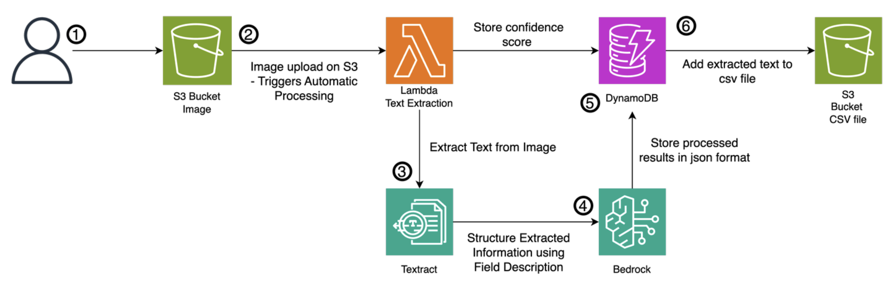

# Textract Processor Deployment Guide

This template is a standalone sample: an event-driven OCR pipeline, deployed as
infrastructure. It is **not** the interactive engine-comparison app in the
[repository README](../README.md) and shares no code or configuration with it.

## CloudFormation Stack Features

This CloudFormation template deploys an OCR document processing solution with the following components:

- **S3 Bucket**: Storage for original images and processing results
- **Lambda Function**: Text extraction using Amazon Textract and JSON structuring with Bedrock AI
- **DynamoDB Table**: Storage for extracted data
- **IAM Role**: Required AWS service permissions



**This pipeline handles single images, not PDFs.** The Lambda opens each uploaded object
with Pillow and calls the synchronous `DetectDocumentText`, so it expects PNG or JPEG.
That is the substantive difference from the app in the repository README, which routes
PDFs through Textract's asynchronous APIs.

## Deployment

The template is self-contained — the Lambda code is inline, so there is nothing to
package or upload first. It creates a named IAM role, which is why
`CAPABILITY_NAMED_IAM` is required:

```
aws cloudformation deploy \
  --template-file textract-processor-template.yaml \
  --stack-name textract-processor \
  --capabilities CAPABILITY_NAMED_IAM
```

Every parameter has a default, so no overrides are needed for a first deployment. Pass
them with `--parameter-overrides Key=Value` where you do want to change one:

| Parameter            | Default                                        | Notes                                                                                  |
| -------------------- | ---------------------------------------------- | -------------------------------------------------------------------------------------- |
| `BucketNamePrefix`   | `textract-processor-files`                     | The bucket is named `<prefix>-<account-id>`                                            |
| `DynamoDBTableName`  | `Textract-ImageExtractions`                    |                                                                                        |
| `LambdaFunctionName` | `textract-processor`                           |                                                                                        |
| `RoleNamePrefix`     | `textract-processor-role`                      | The role is named `<prefix>-<stack-name>`                                              |
| `BedrockModelId`     | `us.anthropic.claude-3-7-sonnet-20250219-v1:0` | Used for the JSON structuring step; the model must be enabled in the deployment region |
| `AwsRegion`          | `us-east-1`                                    |                                                                                        |

The account-id suffix on the bucket exists because S3 bucket names are globally unique,
so a bare prefix would collide with someone else's bucket and fail the stack.

The stack outputs the three names you need next — `S3BucketName`, `DynamoDBTableName`
and `LambdaFunctionArn`:

```
aws cloudformation describe-stacks --stack-name textract-processor \
  --query 'Stacks[0].Outputs'
```

## Post-Deployment Configuration

### 1. S3 Event Notification Setup

After deployment, you must **manually** configure S3 event notifications:

1. Navigate to the created S3 bucket in AWS Console
2. Go to Properties > Event notifications > Create event notification
3. Configure:
   - **Event types**: `All object create events`
   - **Prefix**: `images/`
   - **Destination**: Select Lambda function and choose the created textract-processor function

### 2. S3 Bucket Folder Structure

Prepare the following prefix paths (created automatically on first file upload):

```
bucket-name/
    images/                    # Original image upload location (Event trigger)
    schema/                    # JSON schema files
       schema.json           # Data structure definition
       field_description.json # Field descriptions
    annotated_images/         # Debug images with text regions highlighted
    csv_files/                # Session-based result CSV files
```

### 3. Schema File Upload

Upload the following files to the `schema/` folder:

- `schema.json`: JSON structure definition for data extraction
- `field_description.json`: Description for each field

## Usage

1. Upload image files to the `images/` folder
2. Lambda function automatically processes OCR
3. Check results in DynamoDB

## Result Verification

### DynamoDB Check

1. AWS Console > DynamoDB > Tables
2. Select `Textract-ImageExtractions` table
3. View processed data in Items tab:
   - `sessionId`: Date-based session (YYYY-MM-DD)
   - `imageKey`: Processed image filename
   - `jsonData`: Structured extracted data
   - `confidence`: Text extraction confidence score
   - `processedAt`: Processing timestamp

### S3 Check

- `annotated_images/`: Debug images with text regions highlighted
- `csv_files/`: Consolidated CSV files per session (`YYYY-MM-DD.csv`)
